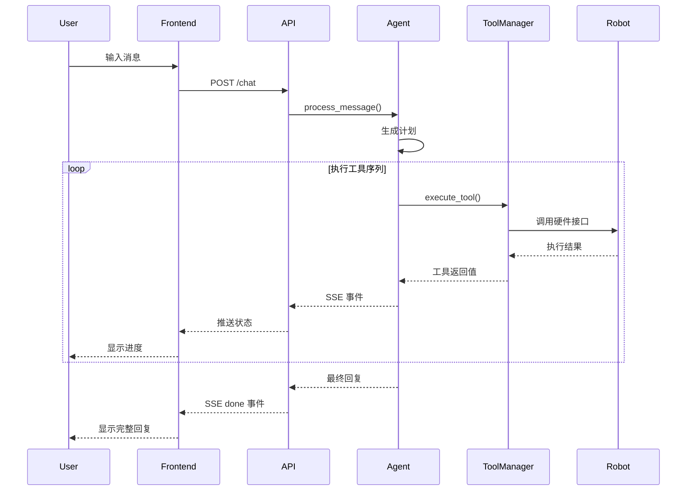

# 架构设计详解

## 1. 系统总体架构

Actio Agent 采用前后端分离的微服务架构，通过事件驱动的设计模式实现智能体与机器人模块的高效协作。系统整体分为三层：**用户交互层**、**智能体编排层**和**机器人执行层**。

### 1.1 架构分层说明

```text
┌─────────────────────────────────────────────────────────────┐
│                      用户交互层                              │
│  ┌──────────────┐  ┌──────────────┐  ┌──────────────┐      │
│  │  Web 前端    │  │  语音识别    │  │  SSE 事件流  │      │
│  │  (React)     │  │  (Web Speech)│  │  (实时反馈)  │      │
│  └──────────────┘  └──────────────┘  └──────────────┘      │
└─────────────────────────────────────────────────────────────┘
                              │
                              ▼
┌─────────────────────────────────────────────────────────────┐
│                    智能体编排层                              │
│  ┌──────────────┐  ┌──────────────┐  ┌──────────────┐      │
│  │  FastAPI     │  │   Planner    │  │ Tool Manager │      │
│  │  (接口服务)  │  │  (规划器)    │  │ (工具管理)   │      │
│  └──────────────┘  └──────────────┘  └──────────────┘      │
│  ┌──────────────┐  ┌──────────────┐  ┌──────────────┐      │
│  │   Agent      │  │   Memory     │  │   LLM 工厂   │      │
│  │  (主智能体)  │  │  (会话记忆)  │  │ (模型客户端) │      │
│  └──────────────┘  └──────────────┘  └──────────────┘      │
└─────────────────────────────────────────────────────────────┘
                              │
                              ▼
┌─────────────────────────────────────────────────────────────┐
│                    机器人执行层                              │
│  ┌──────────────┐  ┌──────────────┐  ┌──────────────┐      │
│  │  Dobot 控制  │  │ RealSense    │  │  推理执行器  │      │
│  │  (双臂/夹爪) │  │ (视觉采集)   │  │ (模型推理)   │      │
│  └──────────────┘  └──────────────┘  └──────────────┘      │
│  ┌──────────────┐  ┌──────────────┐  ┌──────────────┐      │
│  │  数据采集    │  │  模型训练    │  │  安全监控    │      │
│  │  (录制/回放) │  │  (PyTorch)   │  │ (边界检查)   │      │
│  └──────────────┘  └──────────────┘  └──────────────┘      │
└─────────────────────────────────────────────────────────────┘
```

### 1.2 核心数据流

1. **用户请求流**
   - 用户输入 → 前端捕获 → API 提交 → Agent 处理 → 工具调用 → 结果返回

2. **事件通知流**
   - Agent 状态变化 → SSE 推送 → 前端实时更新

3. **机器人控制流**
   - 工具调用 → 硬件接口 → 状态反馈 → 执行确认

4. **训练数据流**
   - 传感器采集 → 数据存储 → 数据预处理 → 模型训练 → 模型部署

## 2. 核心模块设计

### 2.1 前端模块 (`frontend/`)

#### 2.1.1 页面组件结构

```text
frontend/src/
├── pages/
│   └── Index.tsx              # 主聊天界面
├── components/
│   ├── ChatMessage.tsx        # 消息气泡组件
│   ├── TypingIndicator.tsx    # 打字指示器
│   └── VoiceControl.tsx       # 语音控制组件
├── hooks/
│   ├── useSpeechRecognition.ts # 语音识别 Hook
│   ├── useMicLevel.ts          # 麦克风音量 Hook
│   └── useSSE.ts               # SSE 订阅 Hook
└── services/
    └── api.ts                  # API 调用封装
```

#### 2.1.2 状态管理

前端采用 React Hooks 进行状态管理，主要状态包括：

- **聊天状态**：消息列表、当前输入、机器人名称
- **连接状态**：任务 ID、SSE 连接、加载状态
- **语音状态**：录音状态、音量电平、语音识别结果

#### 2.1.3 事件流处理

通过 `EventSource` 接收后端 SSE 流，支持的事件类型：

```typescript
interface SSEEvent {
  type: 'ack' | 'plan' | 'tool' | 'done' | 'error';
  data: any;
  timestamp: string;
}
```

### 2.2 后端模块 (`backend/`)

#### 2.2.1 API 层 (`mainsystem/api.py`)

提供 RESTful 接口和 SSE 端点：

```python
# 主要端点
GET  /health                 # 健康检查
GET  /api/profile            # 获取机器人身份
POST /api/chat               # 提交聊天任务
GET  /api/chat/{task_id}     # 查询任务状态
GET  /api/chat/{task_id}/events  # SSE 事件流
GET  /api/sessions/{session_id}  # 获取会话记忆
```

#### 2.2.2 Agent 核心 (`mainsystem/agent.py`)

主智能体负责整个对话流程的编排：

```python
class Agent:
    def __init__(self):
        self.mode = None          # 'setup' 或 'main'
        self.memory = None        # 会话记忆
        self.tool_manager = None  # 工具管理器
        
    async def process_message(self, message: str, session_id: str):
        # 1. 判断当前模式
        # 2. 加载对应技能提示词
        # 3. 调用 Planner 生成计划
        # 4. 执行工具序列
        # 5. 返回最终回复
```

**工作流程**：

1. **模式判断**：检查 `bot_config.toml` 是否已配置
2. **技能加载**：
   - `setup` 模式：加载初始化技能提示词
   - `main` 模式：加载正常交互技能提示词
3. **计划生成**：调用 Planner 生成工具调用序列
4. **工具执行**：依次执行计划中的工具
5. **状态更新**：更新会话记忆和任务状态

#### 2.2.3 Planner 规划器 (`mainsystem/planner.py`)

将用户意图转换为可执行的工具调用序列：

```python
class Planner:
    async def generate_plan(self, user_input: str, context: dict):
        # 1. 构建系统提示词（包含可用工具列表）
        # 2. 调用 LLM 生成 JSON 格式的计划
        # 3. 解析并验证工具调用
        # 4. 返回计划对象
```

**计划格式**：

```json
{
  "thought": "用户想要抓取 cube_001，我需要调用 pick_up 工具",
  "actions": [
    {
      "tool": "pick_up",
      "arguments": {
        "target_id": "cube_001"
      }
    },
    {
      "tool": "send_message",
      "arguments": {
        "content": "正在为您抓取 cube_001..."
      }
    }
  ]
}
```

#### 2.2.4 Tool Manager (`mainsystem/tool_manager.py`)

自动发现和注册工具：

```python
class ToolManager:
    def __init__(self):
        self.tools = {}
        self._discover_tools()
    
    def _discover_tools(self):
        # 扫描 tools/ 目录，自动导入继承 BaseTool 的类
        # 注册到 tools 字典中
        
    async def execute_tool(self, tool_name: str, **kwargs):
        # 执行指定工具，返回结果
```

#### 2.2.5 LLM 工厂 (`llm_api/`)

支持多模型提供商：

```text
llm_api/
├── model_client/
│   ├── base.py           # 客户端基类
│   ├── openai_client.py  # OpenAI 兼容客户端
│   └── anthropic_client.py # Anthropic 客户端（预留）
├── factory.py            # 工厂类
└── config.py             # 配置加载
```

### 2.3 机器人模块 (`dobot_xtrainer/`)

#### 2.3.1 控制模块结构

```text
dobot_xtrainer/
├── controllers/
│   ├── dobot_arm.py      # 机械臂控制
│   ├── gripper.py        # 夹爪控制
│   └── safety.py         # 安全检查
├── vision/
│   ├── realsense.py      # RealSense 相机接口
│   └── calibration.py    # 相机标定
├── data/
│   ├── collection/       # 数据采集
│   └── dataset/          # 数据集管理
├── ModelTrain/
│   ├── model_train.py    # 训练入口
│   └── models/           # 模型定义
└── experiments/
    └── run_inference.py  # 推理入口
```

#### 2.3.2 安全机制

系统内置多层安全检查：

1. **关节范围检查**：确保每个关节角度在安全范围内
2. **工作空间检查**：限制末端执行器在工作空间内
3. **增量约束**：动作增量不超过最大步长
4. **碰撞检测**：基于视觉的碰撞预警

#### 2.3.3 推理执行器 (`mainsystem/inference_runner.py`)

封装模型推理流程：

```python
class InferenceRunner:
    def __init__(self, target_id: str):
        self.model_path = f"data/model/{target_id}/{target_id}.ckpt"
        self.camera = None
        self.arm = None
        
    async def execute_grasp(self):
        # 1. 获取当前相机图像
        # 2. 运行模型推理
        # 3. 计算机械臂运动轨迹
        # 4. 执行抓取动作
        # 5. 返回执行结果
```

## 3. 数据流详解

### 3.1 对话处理流程

```text
[用户] ──消息──→ [前端] ──POST /chat──→ [API]
                                          │
                                          ▼
                                    [Agent.process_message]
                                          │
                    ┌─────────────────────┼─────────────────────┐
                    │                     │                     │
                    ▼                     ▼                     ▼
            [模式判断]            [加载技能]            [生成计划]
                    │                     │                     │
                    └─────────────────────┼─────────────────────┘
                                          │
                                          ▼
                                    [执行工具链]
                                          │
                    ┌─────────────────────┼─────────────────────┐
                    │                     │                     │
                    ▼                     ▼                     ▼
            [send_message]         [pick_up]            [move]
                    │                     │                     │
                    └─────────────────────┼─────────────────────┘
                                          │
                                          ▼
                                    [返回结果]
                                          │
                                          ▼
[前端] ←──SSE events── [API] ←──[最终回复]
```

### 3.2 工具调用时序



## 4. 配置管理

### 4.1 配置层级

```text
configs/
├── llm_api_config.toml    # LLM 服务配置
├── bot_config.toml        # 机器人人格配置
├── hardware_config.toml   # 硬件参数配置（预留）
└── safety_config.toml     # 安全阈值配置（预留）
```

### 4.2 LLM 配置结构

```toml
[[api_providers]]
name = "OpenAI"
base_url = "https://api.openai.com/v1"
api_key = "sk-xxx"
client_type = "openai"
max_retry = 3
timeout = 120
retry_interval = 5

[models]
[models.gpt4]
provider = "OpenAI"
model_identifier = "gpt-4"

[model_task_config]
[model_task_config.planner]
model_list = ["gpt4"]
temperature = 0.2
max_tokens = 2000

[model_task_config.replyer]
model_list = ["gpt4"]
temperature = 0.7
max_tokens = 500

[model_task_config.default]
model_list = ["gpt4"]
temperature = 0.5
max_tokens = 1000
```

## 5. 扩展点设计

### 5.1 新增工具

1. 在 `backend/tools/` 创建新文件
2. 继承 `BaseTool` 类
3. 实现 `execute` 方法
4. 添加工具描述

```python
from backend.tools.base import BaseTool

class MyNewTool(BaseTool):
    name = "my_tool"
    description = "工具功能描述"
    
    def __init__(self):
        super().__init__()
    
    async def execute(self, **kwargs) -> dict:
        # 实现工具逻辑
        return {"status": "success"}
```

### 5.2 新增 LLM 提供商

1. 在 `llm_api/model_client/` 创建新客户端
2. 继承 `BaseClient`
3. 实现 `chat_completion` 方法
4. 在配置中添加提供商

```python
from backend.llm_api.model_client.base import BaseClient

class MyProviderClient(BaseClient):
    def __init__(self, config):
        super().__init__(config)
    
    async def chat_completion(self, messages, **kwargs):
        # 实现 API 调用
        pass
```

### 5.3 新增机器人动作

1. 在 `dobot_xtrainer/controllers/` 扩展控制器
2. 在 `backend/tools/` 创建对应工具
3. 添加安全检查
4. 注册到工具管理器

## 6. 监控与日志


### 6.1 任务追踪

每个任务通过 `task_id` 追踪：

```python
{
    "task_id": "uuid",
    "session_id": "session-uuid",
    "status": "pending|running|done|error",
    "created_at": "timestamp",
    "events": [...],
    "result": {...}
}
```

### 6.2 性能监控指标

- **API 响应时间**：每个端点的平均响应时间
- **LLM 调用耗时**：计划生成和回复生成的时间
- **工具执行耗时**：每个工具的执行时间
- **硬件响应延迟**：机器人动作的执行延迟

## 7. 部署架构

### 7.1 单机部署

```text
┌─────────────────────────────────────┐
│           单一服务器                 │
│  ┌───────────┐  ┌───────────┐      │
│  │ 前端服务  │  │ 后端服务  │      │
│  │ :8080     │  │ :8000     │      │
│  └───────────┘  └───────────┘      │
│  ┌───────────┐  ┌───────────┐      │
│  │ 机器人    │  │ 视觉系统  │      │
│  │ 控制器    │  │ 处理      │      │
│  └───────────┘  └───────────┘      │
└─────────────────────────────────────┘
```

### 7.2 分布式部署（未来扩展）

```text
┌─────────────┐    ┌─────────────┐    ┌─────────────┐
│  负载均衡   │───▶│  Web 服务   │───▶│  LLM 服务   │
│  (Nginx)    │    │  (多实例)   │    │  (集群)     │
└─────────────┘    └─────────────┘    └─────────────┘
                         │
                         ▼
┌─────────────┐    ┌─────────────┐
│  机器人集群 │    │  数据存储   │
│  (多台)     │    │  (Redis/DB) │
└─────────────┘    └─────────────┘
```

## 8. 安全设计

### 8.1 输入验证

- 所有 API 输入使用 Pydantic 模型验证
- 消息内容长度限制
- SQL 注入防护（参数化查询）

### 8.2 硬件安全

- 动作前预检查
- 实时监控关节状态
- 紧急停止机制
- 看门狗定时器

### 8.3 访问控制

- API Key 验证（预留）
- CORS 配置限制
- 会话隔离

---

*本文档详细描述了 Actio Agent 系统的架构设计，包括模块划分、数据流、扩展点和部署方案。如需了解具体模块的实现细节，请参考对应的源代码和 API 文档。*